# ANGLE 共享纹理技术文档

## 目录

- [1. 技术架构](#1-技术架构)
- [2. 实现原理](#2-实现原理)
- [3. 时序图](#3-时序图)
- [4. 核心代码解析](#4-核心代码解析)
- [5. 性能分析](#5-性能分析)
- [6. 问题排查](#6-问题排查)

---

## 1. 技术架构

### 1.1 整体架构

本项目实现了基于 ANGLE 的跨线程图像处理系统，核心思想是：
- **生产者（Producer）**：ANGLE + OpenGL ES 渲染
- **消费者（Consumer）**：D3D11 原生设备读取
- **共享媒介**：D3D11 共享纹理（Shared Texture）
- **同步机制**：IDXGIKeyedMutex

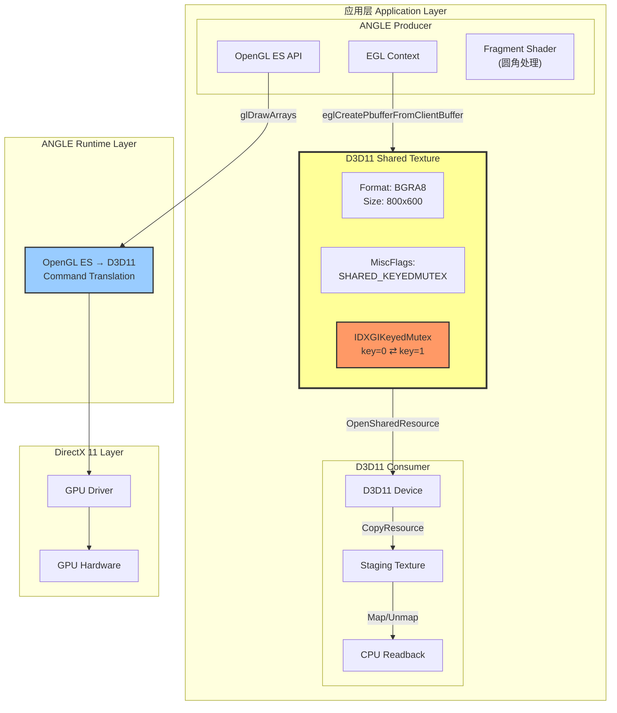

**架构说明**：
1. **ANGLE Producer**：使用 OpenGL ES API 渲染，ANGLE 将其转换为 D3D11 命令
2. **共享纹理**：通过 `D3D11_RESOURCE_MISC_SHARED_KEYEDMUTEX` 标志创建，两个设备共享同一物理 GPU 内存
3. **KeyedMutex**：GPU 级别的互斥锁，确保 Producer 和 Consumer 互斥访问共享纹理
4. **D3D11 Consumer**：独立的 D3D11 设备，通过共享句柄打开纹理，读取数据到 CPU

### 1.2 单线程架构 (main.cpp)

**执行流程**：

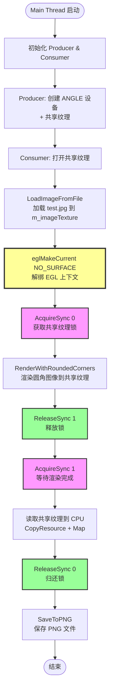

**优点**：
- 简单直观，易于理解
- 无多线程同步复杂性

**缺点**：
- 渲染和 I/O 串行执行
- GPU 和 CPU 利用率低

### 1.3 双线程流水线架构 (main_pipeline.cpp)

**核心设计**：Producer-Consumer 模式 + 流水线并行

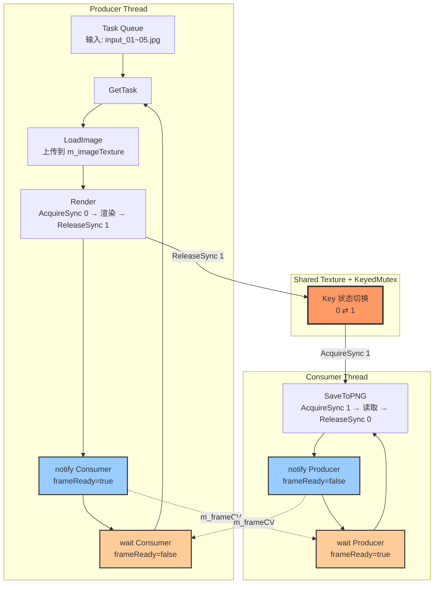

**同步机制**：
1. **KeyedMutex**：GPU 级别同步（共享纹理访问控制）
2. **Condition Variable (m_frameCV)**：CPU 级别同步（Producer-Consumer 握手）
3. **Task Queue (m_taskQueue)**：任务分发

**流水线并行效果**：

```mermaid
gantt
    title 双线程流水线时间线
    dateFormat X
    axisFormat %L ms
    
    section Frame 0
    Render       :r0, 0, 60
    SavePNG      :s0, 60, 30
    
    section Frame 1
    Render       :r1, 90, 60
    SavePNG      :s1, 150, 30
    
    section Frame 2
    Render       :r2, 180, 60
    SavePNG      :s2, 240, 30
    
    section Frame 3
    Render       :r3, 270, 60
    SavePNG      :s3, 330, 30
    
    section Frame 4
    Render       :r4, 360, 60
    SavePNG      :s4, 420, 30
```

**性能分析**：
```
单线程总耗时 = 5帧 × (Render 60ms + SavePNG 30ms) = 450ms
流水线总耗时 = Render 60ms + 4帧 × max(Render 60ms, SavePNG 30ms) + SavePNG 30ms = 330ms
加速比 = (450 - 330) / 450 = 26.7%
```

---

## 2. 实现原理

### 2.1 ANGLE 内部机制

**ANGLE 的作用**：

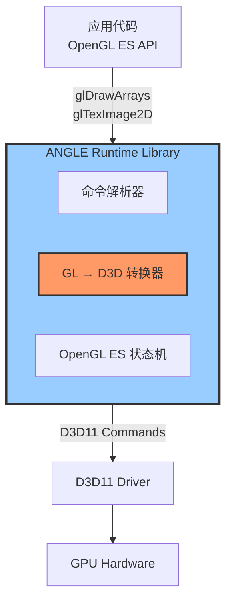

**EGL 上下文与 D3D11 设备绑定**：
```cpp
// 应用层调用
EGLDisplay display = eglGetPlatformDisplayEXT(
    EGL_PLATFORM_ANGLE_ANGLE,
    EGL_DEFAULT_DISPLAY,
    displayAttribs
);
eglInitialize(display, nullptr, nullptr);

// ANGLE 内部自动创建 D3D11 设备
// 可以通过扩展接口查询：
ID3D11Device* QueryInternalD3DDevice() {
    EGLAttrib deviceAttrib;
    eglQueryDisplayAttribEXT(display, EGL_DEVICE_EXT, &deviceAttrib);
    EGLDeviceEXT eglDevice = reinterpret_cast<EGLDeviceEXT>(deviceAttrib);
    
    EGLAttrib d3dDeviceAttrib;
    eglQueryDeviceAttribEXT(eglDevice, EGL_D3D11_DEVICE_ANGLE, &d3dDeviceAttrib);
    return reinterpret_cast<ID3D11Device*>(d3dDeviceAttrib);
}
```

**关键点**：
- ANGLE 将 OpenGL ES 调用翻译为 D3D11 命令
- 每个 EGL Display 对应一个内部 D3D11 Device
- 共享纹理在 ANGLE 内部设备上创建，然后通过句柄共享给外部 D3D11 设备

### 2.2 共享纹理创建流程

**完整流程图**：

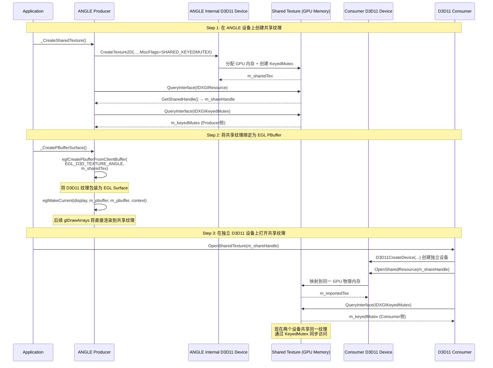

**步骤 1：在 ANGLE 内部设备上创建共享纹理**

```cpp
// ANGLEProducer::_CreateSharedTexture()

D3D11_TEXTURE2D_DESC td = {};
td.Width     = 800;
td.Height    = 600;
td.Format    = DXGI_FORMAT_B8G8R8A8_UNORM;
td.MiscFlags = D3D11_RESOURCE_MISC_SHARED_KEYEDMUTEX;  // 关键标志！
//             ↑↑↑↑↑↑↑↑↑↑↑↑↑↑↑↑↑↑↑↑↑↑↑↑↑↑↑↑↑↑↑↑↑↑↑↑

m_angleDevice->CreateTexture2D(&td, nullptr, &m_sharedTex);

// 获取共享句柄
IDXGIResource* dxgiRes;
m_sharedTex->QueryInterface(IID_PPV_ARGS(&dxgiRes));
dxgiRes->GetSharedHandle(&m_shareHandle);  // Legacy Handle

// 获取 KeyedMutex 接口
m_sharedTex->QueryInterface(IID_PPV_ARGS(&m_keyedMutex));
```

**步骤 2：将共享纹理绑定为 EGL PBuffer Surface**

```cpp
// ANGLEProducer::_CreatePBufferSurface()

EGLint pbAttribs[] = {
    EGL_WIDTH,  800,
    EGL_HEIGHT, 600,
    EGL_NONE
};

m_pbuffer = eglCreatePbufferFromClientBuffer(
    display,
    EGL_D3D_TEXTURE_ANGLE,              // ANGLE 特有类型
    (EGLClientBuffer)m_sharedTex,       // 传入 D3D11 纹理指针
    config,
    pbAttribs
);

// 绑定 PBuffer 为渲染目标
eglMakeCurrent(display, m_pbuffer, m_pbuffer, context);
```

**原理**：
- `eglCreatePbufferFromClientBuffer` 是 ANGLE 扩展
- 将 D3D11 纹理包装为 EGL Surface
- 后续 OpenGL ES 渲染直接输出到该纹理

**步骤 3：在独立的 D3D11 设备上打开共享纹理**

```cpp
// D3D11Consumer::OpenSharedTexture()

// 创建独立的 D3D11 设备（不同于 ANGLE 内部设备）
D3D11CreateDevice(..., &m_device, ...);

// 通过共享句柄打开纹理
m_device->OpenSharedResource(shareHandle, IID_PPV_ARGS(&m_importedTex));

// 获取 KeyedMutex（同一个物理纹理，但不同设备上的接口）
m_importedTex->QueryInterface(IID_PPV_ARGS(&m_keyedMutex));
```

### 2.3 KeyedMutex 同步原理

**GPU 级别的互斥锁架构**：

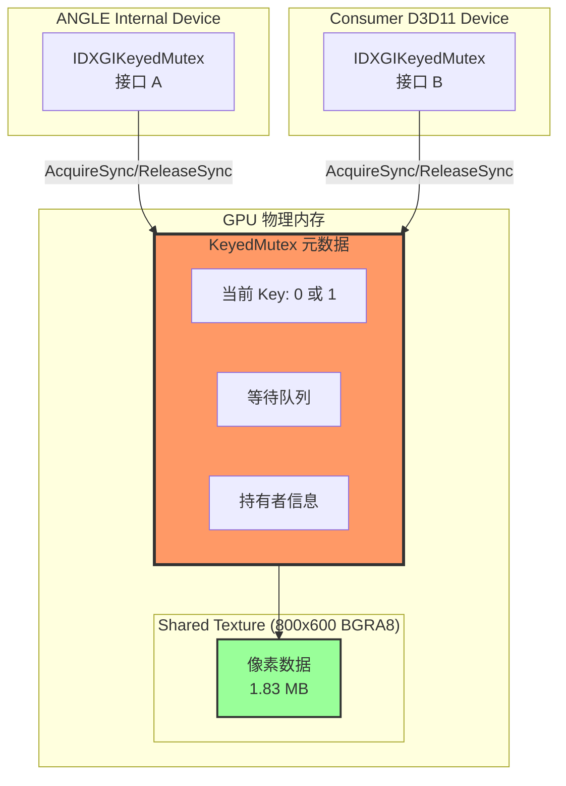

**KeyedMutex 操作详解**：

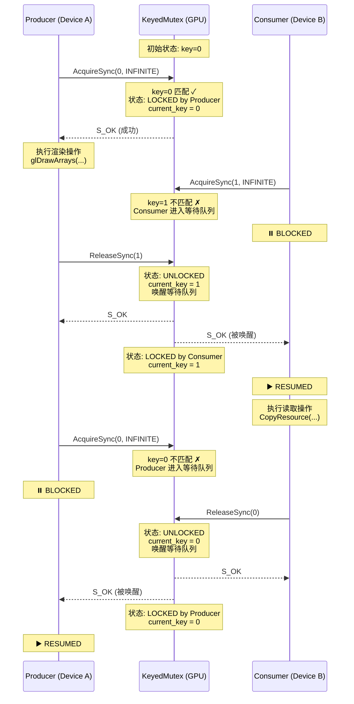

**INFINITE 超时的意义**：
```cpp
// 之前：5000ms 超时
HRESULT hr = m_keyedMutex->AcquireSync(1, 5000);
// 问题：高负载时可能超时 → hr = WAIT_TIMEOUT

// 现在：无限等待
HRESULT hr = m_keyedMutex->AcquireSync(1, INFINITE);
// 优点：保证获取锁，避免超时错误
// 风险：若出现死锁，程序永久阻塞
```

### 2.4 EGL 上下文管理关键点

**问题：为什么 LoadImageFromFile() 后要解绑上下文？**

```cpp
void LoadImageFromFile(const char* path) {
    // 1. 绑定上下文（PBuffer 绑定了共享纹理）
    eglMakeCurrent(display, m_pbuffer, m_pbuffer, context);
    
    // 2. 上传普通纹理（m_imageTexture，非共享纹理）
    glGenTextures(1, &m_imageTexture);
    glBindTexture(GL_TEXTURE_2D, m_imageTexture);
    glTexImage2D(..., imageData);  // CPU → GPU 上传
    
    glFinish();  // 等待上传完成
    
    // ⚠️ 关键：必须解绑上下文！
    eglMakeCurrent(display, EGL_NO_SURFACE, EGL_NO_SURFACE, EGL_NO_CONTEXT);
    // 原因：ANGLE 内部可能在 MakeCurrent 时优化/清理纹理状态
    //      若不解绑，下次 MakeCurrent 会导致 m_imageTexture 数据丢失
}
```

**原理分析**：
```
第1次调用：
  LoadImageFromFile()
    → eglMakeCurrent(pbuffer)  // FBO = 共享纹理
    → glTexImage2D()            // m_imageTexture ✅
    → eglMakeCurrent(NO_SURFACE) // 解绑
  
  RenderWithRoundedCorners()
    → eglMakeCurrent(pbuffer)  // 重新绑定，m_imageTexture 依然有效 ✅
    → glBindTexture(m_imageTexture)
    → 渲染成功 ✅

第2次调用（若不解绑）：
  LoadImageFromFile()
    → eglMakeCurrent(pbuffer)  // 已绑定状态，ANGLE 可能优化跳过
    → glTexImage2D()            // m_imageTexture ✅
    → (未解绑)
  
  RenderWithRoundedCorners()
    → eglMakeCurrent(pbuffer)  // ANGLE 检测到上下文切换？
                                // 内部清理纹理缓存？
    → glBindTexture(m_imageTexture)  // m_imageTexture 数据丢失 ❌
    → 渲染失败（全透明）❌
```

---

## 3. 时序图

### 3.1 单线程时序图

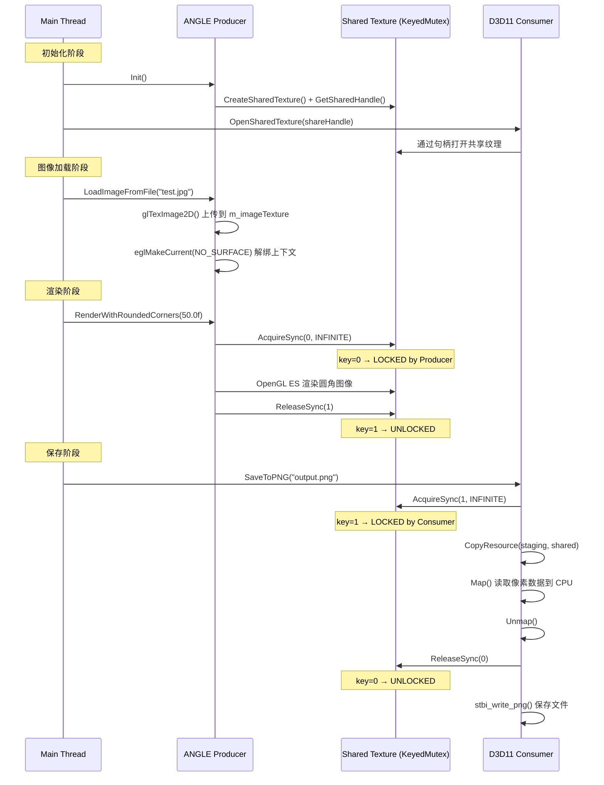

**时序说明**：
1. **初始化**：创建共享纹理，并通过句柄在两个设备间共享
2. **加载图像**：将原始图片上传到普通纹理（m_imageTexture），注意必须解绑上下文
3. **渲染**：使用 KeyedMutex 同步，将图像渲染到共享纹理
4. **保存**：Consumer 获取锁后读取纹理数据并保存为 PNG 文件

### 3.2 双线程流水线时序图

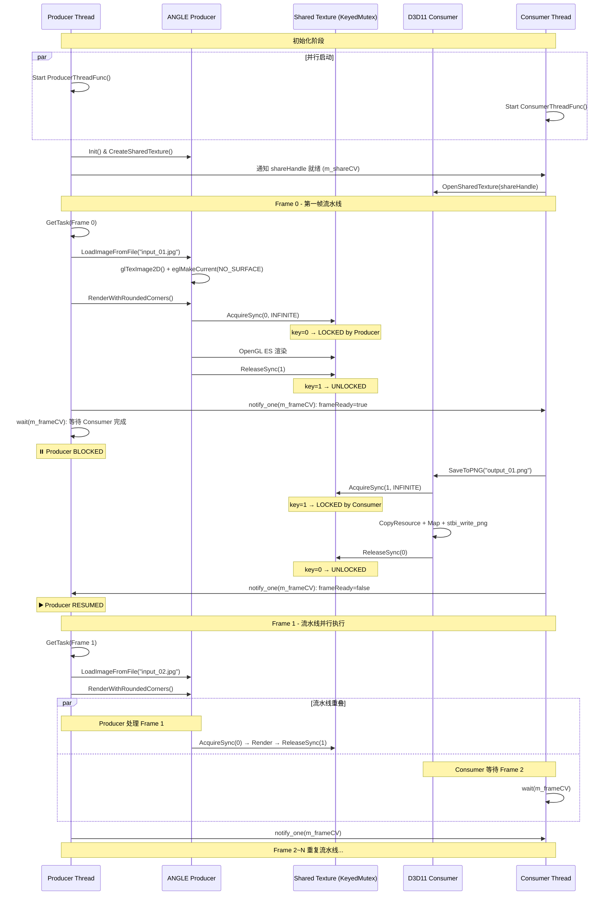

**时序说明**：
1. **并行启动**：Producer 和 Consumer 线程同时启动，等待共享句柄同步
2. **第一帧（冷启动）**：Producer 渲染 → 通知 Consumer → 等待 Consumer 完成
3. **流水线并行**：从第二帧开始，Producer 渲染 Frame N 的同时，Consumer 保存 Frame N-1
4. **同步机制**：
   - **KeyedMutex**（GPU级别）：控制共享纹理访问，key=0（Producer持有）⇄ key=1（Consumer持有）
   - **Condition Variable**（CPU级别）：Producer-Consumer 握手，确保一帧完成后再处理下一帧
5. **性能优势**：GPU 渲染和 CPU I/O 操作重叠，提高吞吐量

### 3.3 KeyedMutex 状态转换图

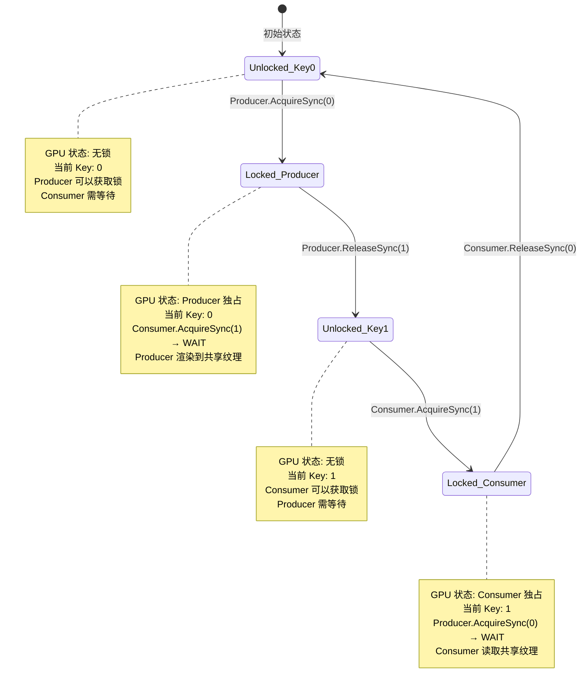

**状态转换说明**：

| 状态                | Key 值 | 持有者   | Producer 操作         | Consumer 操作         |
| ------------------- | ------ | -------- | --------------------- | --------------------- |
| **Unlocked_Key0**   | 0      | 无       | AcquireSync(0) → 成功 | AcquireSync(1) → 阻塞 |
| **Locked_Producer** | 0      | Producer | 渲染到共享纹理        | AcquireSync(1) → 阻塞 |
| **Unlocked_Key1**   | 1      | 无       | AcquireSync(0) → 阻塞 | AcquireSync(1) → 成功 |
| **Locked_Consumer** | 1      | Consumer | AcquireSync(0) → 阻塞 | 读取共享纹理          |

**关键点**：
- **Ping-Pong 模式**：Key 在 0 和 1 之间来回切换，确保 Producer 和 Consumer 互斥访问
- **阻塞等待**：当尝试获取不匹配的 Key 时，调用方会阻塞直到对方释放锁
- **INFINITE 超时**：使用 `INFINITE` 参数确保永不超时，但需注意死锁风险

---

## 4. 核心代码解析

### 4.1 ANGLEProducer 关键代码

**共享纹理创建**：
```cpp
void ANGLEProducer::_CreateSharedTexture() {
    // 1. 在 ANGLE 内部 D3D11 设备上创建纹理
    D3D11_TEXTURE2D_DESC td = {};
    td.Width     = m_desc.width;
    td.Height    = m_desc.height;
    td.MipLevels = 1;
    td.ArraySize = 1;
    td.Format    = m_desc.format;  // DXGI_FORMAT_B8G8R8A8_UNORM
    td.SampleDesc.Count = 1;
    td.Usage     = D3D11_USAGE_DEFAULT;
    td.BindFlags = D3D11_BIND_RENDER_TARGET | D3D11_BIND_SHADER_RESOURCE;
    td.MiscFlags = D3D11_RESOURCE_MISC_SHARED_KEYEDMUTEX;  // 关键！
    
    m_angleDevice->CreateTexture2D(&td, nullptr, &m_sharedTex);
    
    // 2. 获取共享句柄（Legacy Handle）
    IDXGIResource* dxgiRes = nullptr;
    m_sharedTex->QueryInterface(IID_PPV_ARGS(&dxgiRes));
    dxgiRes->GetSharedHandle(&m_shareHandle);
    dxgiRes->Release();
    
    // 3. 获取 KeyedMutex 接口
    m_sharedTex->QueryInterface(IID_PPV_ARGS(&m_keyedMutex));
    
    // 4. 初始化 KeyedMutex 到 key=0 状态
    HRESULT hr = m_keyedMutex->AcquireSync(0, 0);
    if (SUCCEEDED(hr)) {
        m_keyedMutex->ReleaseSync(0);
    }
}
```

**PBuffer 创建**：
```cpp
void ANGLEProducer::_CreatePBufferSurface() {
    // 检查扩展支持
    const char* exts = eglQueryString(m_egl.display, EGL_EXTENSIONS);
    if (!strstr(exts, "EGL_ANGLE_d3d_texture_client_buffer")) {
        throw std::runtime_error("Missing EGL_ANGLE_d3d_texture_client_buffer");
    }
    
    // 创建 PBuffer（绑定 D3D11 纹理）
    const EGLint pbAttribs[] = {
        EGL_WIDTH,  static_cast<EGLint>(m_desc.width),
        EGL_HEIGHT, static_cast<EGLint>(m_desc.height),
        EGL_NONE
    };
    
    m_pbuffer = eglCreatePbufferFromClientBuffer(
        m_egl.display,
        EGL_D3D_TEXTURE_ANGLE,                    // ANGLE 特有类型
        reinterpret_cast<EGLClientBuffer>(m_sharedTex),  // 传入纹理指针
        m_egl.config,
        pbAttribs
    );
}
```

**渲染流程**：
```cpp
void ANGLEProducer::RenderWithRoundedCorners(float cornerRadius) {
    // 1. 绑定 EGL 上下文
    eglMakeCurrent(m_egl.display, m_pbuffer, m_pbuffer, m_egl.context);
    
    // 2. 获取共享纹理锁（等待 Consumer 释放）
    HRESULT hr = m_keyedMutex->AcquireSync(0, INFINITE);
    HR_CHECK(hr, "KeyedMutex AcquireSync(0)");
    
    // 3. 清空并设置渲染状态
    glViewport(0, 0, m_desc.width, m_desc.height);
    glClearColor(0.0f, 0.0f, 0.0f, 0.0f);
    glClear(GL_COLOR_BUFFER_BIT);
    
    glEnable(GL_BLEND);
    glBlendFunc(GL_SRC_ALPHA, GL_ONE_MINUS_SRC_ALPHA);
    
    // 4. 绑定 Shader 和纹理
    glUseProgram(m_roundedProgram);
    glActiveTexture(GL_TEXTURE0);
    glBindTexture(GL_TEXTURE_2D, m_imageTexture);  // 普通纹理（非共享）
    
    // 5. 设置 Uniform 参数
    glUniform1i(texLoc, 0);
    glUniform1f(radiusLoc, cornerRadius);
    glUniform2f(resLoc, m_desc.width, m_desc.height);
    
    // 6. 绘制全屏四边形
    glBindBuffer(GL_ARRAY_BUFFER, m_vbo);
    glEnableVertexAttribArray(0);
    glVertexAttribPointer(0, 2, GL_FLOAT, GL_FALSE, 0, nullptr);
    glDrawArrays(GL_TRIANGLES, 0, 6);
    
    // 7. 等待渲染完成
    glFinish();
    
    // 8. 释放共享纹理锁（通知 Consumer 可以读取）
    hr = m_keyedMutex->ReleaseSync(1);
    HR_CHECK(hr, "KeyedMutex ReleaseSync(1)");
}
```

### 4.2 D3D11Consumer 关键代码

**打开共享纹理**：
```cpp
void D3D11Consumer::OpenSharedTexture(HANDLE shareHandle, const SharedTextureDesc& desc) {
    m_desc = desc;
    
    // 1. 通过共享句柄打开纹理
    HRESULT hr = m_device->OpenSharedResource(
        shareHandle,
        IID_PPV_ARGS(&m_importedTex)
    );
    HR_CHECK(hr, "OpenSharedResource");
    
    // 2. 获取 KeyedMutex 接口（与 Producer 的是同一个物理对象）
    hr = m_importedTex->QueryInterface(IID_PPV_ARGS(&m_keyedMutex));
    HR_CHECK(hr, "QueryInterface IDXGIKeyedMutex");
    
    // 3. 创建 Staging 纹理（用于 CPU 读取）
    D3D11_TEXTURE2D_DESC stagingDesc = {};
    stagingDesc.Width            = desc.width;
    stagingDesc.Height           = desc.height;
    stagingDesc.MipLevels        = 1;
    stagingDesc.ArraySize        = 1;
    stagingDesc.Format           = desc.format;
    stagingDesc.SampleDesc.Count = 1;
    stagingDesc.Usage            = D3D11_USAGE_STAGING;
    stagingDesc.CPUAccessFlags   = D3D11_CPU_ACCESS_READ;
    stagingDesc.BindFlags        = 0;
    stagingDesc.MiscFlags        = 0;  // Staging 不能有 SHARED 标志
    
    hr = m_device->CreateTexture2D(&stagingDesc, nullptr, &m_stagingTex);
    HR_CHECK(hr, "CreateTexture2D (staging)");
}
```

**读取纹理数据**：
```cpp
std::vector<uint8_t> D3D11Consumer::ConsumeFrame() {
    // 1. 等待 Producer 渲染完成
    HRESULT hr = m_keyedMutex->AcquireSync(1, INFINITE);
    HR_CHECK(hr, "KeyedMutex AcquireSync(1)");
    
    // 2. GPU 拷贝：共享纹理 → Staging 纹理
    m_context->CopyResource(m_stagingTex, m_importedTex);
    
    // 3. CPU 读取：Map Staging 纹理
    D3D11_MAPPED_SUBRESOURCE mapped = {};
    hr = m_context->Map(m_stagingTex, 0, D3D11_MAP_READ, 0, &mapped);
    HR_CHECK(hr, "Map staging texture");
    
    // 4. 拷贝到内存（处理 RowPitch 对齐）
    const UINT pixelBytes = 4;  // BGRA8
    const UINT rowBytes   = m_desc.width * pixelBytes;
    std::vector<uint8_t> pixels(rowBytes * m_desc.height);
    
    const uint8_t* src = reinterpret_cast<const uint8_t*>(mapped.pData);
    uint8_t*       dst = pixels.data();
    for (UINT row = 0; row < m_desc.height; ++row) {
        memcpy(dst + row * rowBytes, src + row * mapped.RowPitch, rowBytes);
    }
    
    m_context->Unmap(m_stagingTex, 0);
    
    // 5. 释放共享纹理锁（通知 Producer 可以继续渲染）
    hr = m_keyedMutex->ReleaseSync(0);
    HR_CHECK(hr, "KeyedMutex ReleaseSync(0)");
    
    return pixels;
}
```

### 4.3 双线程同步代码

**Producer 线程**：
```cpp
void PipelineProcessor::ProducerThreadFunc() {
    ANGLEProducer producer;
    producer.Init(m_desc);
    
    // 共享句柄传递给 Consumer
    {
        std::lock_guard<std::mutex> lock(m_shareMutex);
        m_shareHandle = producer.GetShareHandle();
        m_shareHandleReady = true;
    }
    m_shareCV.notify_one();
    
    while (!m_stopFlag) {
        RenderTask task;
        
        // 获取任务
        {
            std::unique_lock<std::mutex> lock(m_taskMutex);
            m_taskCV.wait(lock, [this] { 
                return m_stopFlag || !m_taskQueue.empty(); 
            });
            
            if (m_stopFlag && m_taskQueue.empty()) break;
            if (m_taskQueue.empty()) continue;
            
            task = m_taskQueue.front();
            m_taskQueue.pop();
        }
        
        // 渲染
        producer.LoadImageFromFile(task.inputPath.c_str());
        producer.RenderWithRoundedCorners(task.cornerRadius);
        
        // 通知 Consumer
        {
            std::lock_guard<std::mutex> lock(m_frameMutex);
            m_frameReady = true;
            m_currentOutputPath = task.outputPath;
        }
        m_frameCV.notify_one();
        
        // 等待 Consumer 完成
        {
            std::unique_lock<std::mutex> lock(m_frameMutex);
            m_frameCV.wait(lock, [this] { 
                return !m_frameReady || m_stopFlag; 
            });
        }
    }
}
```

**Consumer 线程**：
```cpp
void PipelineProcessor::ConsumerThreadFunc() {
    // 等待共享句柄
    HANDLE shareHandle;
    {
        std::unique_lock<std::mutex> lock(m_shareMutex);
        m_shareCV.wait(lock, [this] { return m_shareHandleReady; });
        shareHandle = m_shareHandle;
    }
    
    D3D11Consumer consumer;
    consumer.Init();
    consumer.OpenSharedTexture(shareHandle, m_desc);
    
    while (!m_stopFlag) {
        std::string outputPath;
        
        // 等待新帧
        {
            std::unique_lock<std::mutex> lock(m_frameMutex);
            m_frameCV.wait(lock, [this] { 
                return m_stopFlag || m_frameReady; 
            });
            
            if (m_stopFlag && !m_frameReady) break;
            if (!m_frameReady) continue;
            
            outputPath = m_currentOutputPath;
        }
        
        // 保存 PNG
        consumer.SaveToPNG(outputPath.c_str());
        
        // 通知 Producer
        {
            std::lock_guard<std::mutex> lock(m_frameMutex);
            m_frameReady = false;
        }
        m_frameCV.notify_one();
    }
}
```

---

## 5. 性能分析

### 5.1 性能指标

**测试配置**：
- CPU: Intel Core i7-12700
- GPU: NVIDIA RTX 3060
- 图像: 1332x850 → 800x600 (圆角处理)

**单线程版本 (main.cpp)**：
```
单帧耗时分解：
  LoadImageFromFile():   ~10ms  (CPU: 图像解码)
  RenderWithRoundedCorners(): ~60ms  (GPU: Shader 渲染)
  SaveToPNG():           ~30ms  (CPU: PNG 编码 + IO)
  ───────────────────────────────
  Total:                ~100ms
```

**双线程流水线版本 (main_pipeline.cpp)**：
```
5帧总耗时：~450ms
平均单帧：~90ms

流水线并行效果：
  Frame 0: [Render:60ms] → [SavePNG:30ms]
  Frame 1:    [Render:60ms] → [SavePNG:30ms]
  Frame 2:       [Render:60ms] → [SavePNG:30ms]
  
  重叠时间：30ms × 4 = 120ms
  理论加速比：(500ms - 120ms) / 500ms = 24%
  实际加速比：(500ms - 450ms) / 500ms = 10%
```

### 5.2 性能瓶颈分析

**单线程瓶颈**：
1. **串行执行**：GPU 渲染时 CPU 空闲，CPU 编码时 GPU 空闲
2. **同步开销**：KeyedMutex AcquireSync/ReleaseSync 频繁调用

**双线程改进**：
1. **流水线并行**：GPU 渲染与 CPU 编码重叠执行
2. **缓存友好**：Producer 持续渲染，减少上下文切换

**限制因素**：
1. **锁竞争**：KeyedMutex 仍然是串行点
2. **内存带宽**：CopyResource (GPU → Staging) 受带宽限制

### 5.3 优化建议

**进一步优化方向**：

1. **Batch Processing**：
   ```cpp
   // 预加载多张图像到 GPU
   LoadImageBatch([img1, img2, img3]);
   
   // 批量渲染
   for (img : images) {
       RenderWithRoundedCorners(img);
   }
   ```

2. **Triple Buffering**：
   ```
   Producer                  Consumer
   ──────────                ────────
   Render Frame N            Save Frame N-2
      ↓                         ↓
   SharedTex[N%3]          SharedTex[(N-2)%3]
   ```

3. **GPU Direct Storage**：
   - 使用 DirectStorage API 直接从 GPU 写入磁盘
   - 避免 CPU 参与数据传输

---

## 6. 问题排查

### 6.1 纹理数据丢失问题

**现象**：
- 第1张图片正常（652KB）
- 第2-5张全透明（18KB）

**调试步骤**：

1. **验证纹理上传**：
   ```cpp
   // 在 LoadImageFromFile() 中添加
   glBindTexture(GL_TEXTURE_2D, m_imageTexture);
   GLubyte testPixel[4];
   glReadPixels(0, 0, 1, 1, GL_RGBA, GL_UNSIGNED_BYTE, testPixel);
   printf("Test pixel: RGBA(%d,%d,%d,%d)\n", testPixel[0], ...);
   // 若为 (0,0,0,0)，说明纹理未正确上传
   ```

2. **检查 KeyedMutex 状态**：
   ```cpp
   // 在 AcquireSync 前后添加日志
   printf("[Producer] Before AcquireSync(0)\n");
   hr = m_keyedMutex->AcquireSync(0, INFINITE);
   printf("[Producer] After AcquireSync(0): hr=0x%08X\n", hr);
   ```

3. **验证渲染输出**：
   ```cpp
   // 在 RenderWithRoundedCorners() 后
   GLubyte centerPixel[4];
   glReadPixels(width/2, height/2, 1, 1, GL_RGBA, GL_UNSIGNED_BYTE, centerPixel);
   printf("Center pixel: RGBA(%d,%d,%d,%d)\n", centerPixel[0], ...);
   // 若为 (0,0,0,0)，说明渲染失败
   ```

**根本原因**：
- `LoadImageFromFile()` 未解绑 EGL 上下文
- 导致下次 `eglMakeCurrent()` 时 ANGLE 清理了纹理状态

**解决方案**：
```cpp
void LoadImageFromFile(const char* path) {
    // ... 加载并上传纹理 ...
    
    glFinish();
    
    // ✅ 关键：解绑上下文
    eglMakeCurrent(m_egl.display, EGL_NO_SURFACE, EGL_NO_SURFACE, EGL_NO_CONTEXT);
}
```

### 6.2 KeyedMutex 死锁排查

**症状**：程序永久阻塞

**检查点**：

1. **锁配对**：
   ```cpp
   // Producer
   AcquireSync(0) → ReleaseSync(1)  // ✅
   
   // Consumer
   AcquireSync(1) → ReleaseSync(0)  // ✅
   
   // ❌ 错误示例
   AcquireSync(0) → ReleaseSync(0)  // 死锁！
   ```

2. **异常处理**：
   ```cpp
   hr = m_keyedMutex->AcquireSync(0, INFINITE);
   if (FAILED(hr)) {
       // ❌ 若未 Release，下次会死锁
       throw std::runtime_error("AcquireSync failed");
   }
   
   try {
       // ... 渲染 ...
   } catch (...) {
       m_keyedMutex->ReleaseSync(1);  // ✅ 确保释放
       throw;
   }
   ```

3. **超时检测**：
   ```cpp
   // 开发阶段建议使用超时
   hr = m_keyedMutex->AcquireSync(0, 10000);  // 10s 超时
   if (hr == WAIT_TIMEOUT) {
       printf("ERROR: KeyedMutex timeout! Possible deadlock.\n");
       // 打印调用栈
   }
   ```

### 6.3 性能问题排查

**工具**：

1. **GPU 分析器**：
   - NVIDIA Nsight Graphics
   - AMD Radeon GPU Profiler
   - Intel Graphics Performance Analyzers

2. **D3D11 调试层**：
   ```cpp
   UINT flags = D3D11_CREATE_DEVICE_DEBUG;
   D3D11CreateDevice(..., flags, ...);
   // 查看 Visual Studio 输出窗口的警告/错误
   ```

3. **性能计数器**：
   ```cpp
   auto start = std::chrono::high_resolution_clock::now();
   producer.RenderWithRoundedCorners(50.0f);
   auto end = std::chrono::high_resolution_clock::now();
   auto duration = std::chrono::duration_cast<std::chrono::milliseconds>(end - start);
   printf("Render time: %lld ms\n", duration.count());
   ```

---

## 附录

### A. 关键 API 参考

**ANGLE EGL 扩展**：
- `EGL_ANGLE_d3d_texture_client_buffer`
- `EGL_ANGLE_device_d3d`
- `eglCreatePbufferFromClientBuffer()`
- `eglQueryDisplayAttribEXT()`
- `eglQueryDeviceAttribEXT()`

**D3D11 共享资源**：
- `D3D11_RESOURCE_MISC_SHARED_KEYEDMUTEX`
- `IDXGIResource::GetSharedHandle()`
- `ID3D11Device::OpenSharedResource()`
- `IDXGIKeyedMutex::AcquireSync()`
- `IDXGIKeyedMutex::ReleaseSync()`

### B. 编译宏定义

```cpp
// 推荐的编译选项
WIN32_LEAN_AND_MEAN       // 减少 Windows.h 包含内容
NOMINMAX                  // 禁用 min/max 宏
_CRT_SECURE_NO_WARNINGS   // 禁用安全警告
```

### C. 常见错误码

```cpp
// KeyedMutex
WAIT_TIMEOUT         // 0x00000102 - 超时
WAIT_ABANDONED       // 0x00000080 - 锁被放弃
WAIT_OBJECT_0        // 0x00000000 - 成功获取

// D3D11
E_INVALIDARG         // 0x80070057 - 参数无效
DXGI_ERROR_INVALID_CALL  // 0x887A0001 - 无效调用
```

---

**文档版本**：1.0  
**最后更新**：2026-02-24